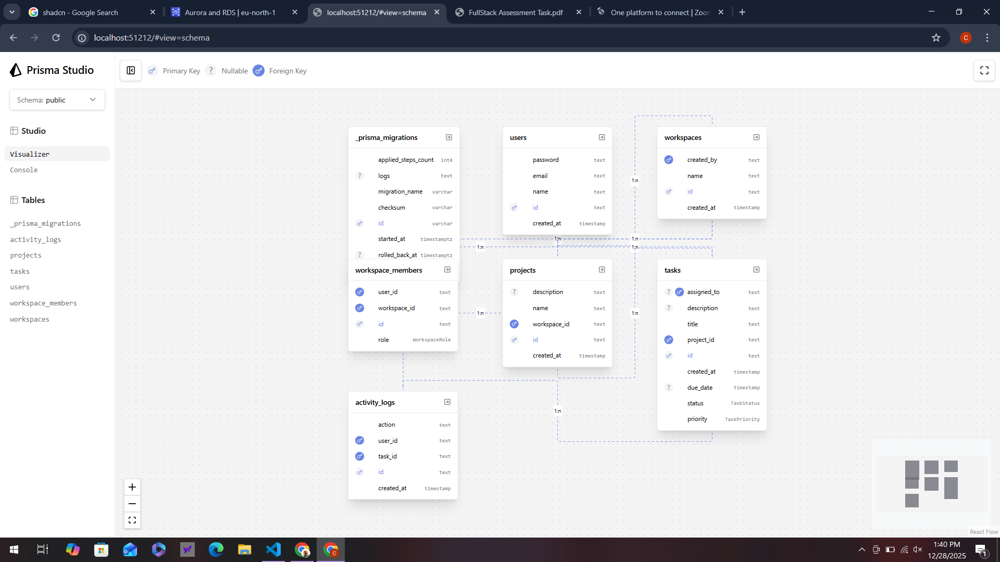
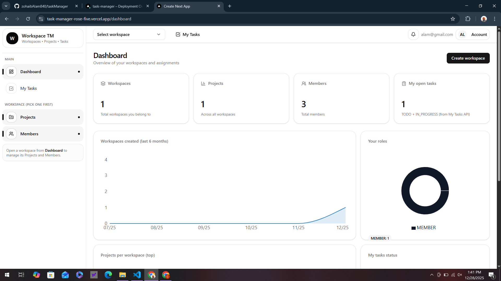

# Task Manager (Next.js + Prisma + Postgres)

A multi-tenant task manager built with **Next.js (App Router)**, **Prisma**, and **Postgres**.  
It supports **Workspaces → Projects → Tasks**, **role-based access control (RBAC)**, a **My Tasks** view (cross-workspace), **activity logs**, and **real-time notifications** using **Server-Sent Events (SSE)**.

---

## Features

### Core
- Email/password authentication (login/signup)
- Multi-tenant structure:
  - **Workspaces** (with members and roles)
  - **Projects** inside workspaces
  - **Tasks** inside projects
- **My Tasks** page: shows tasks assigned to the signed-in user across all workspaces/projects
- Task fields: status, priority, due date, assignee, description
- Activity logging on key task actions (create/update)

### RBAC (Workspace Roles)
- Roles: `OWNER`, `ADMIN`, `MEMBER`
- Typical policies:
  - OWNER/ADMIN can manage workspace, members, projects, tasks
  - MEMBER can view workspace data and update only tasks assigned to them (enforced in API)

### Real-time notifications (SSE)
- Notification stream via **Server-Sent Events**
- Used for events like:
  - task assigned to you
  - task status changed
  - member invited/added 

> Note: SSE is implemented as a lightweight pub/sub style stream (server emits events; client subscribes).  
> For multi-instance scaling, swap the in-memory pub/sub with Redis pub/sub (future enhancement).

---

## Tech Stack

- **Frontend:** Next.js (App Router), React, TypeScript
- **UI:** shadcn/ui, Tailwind CSS, lucide-react, sonner
- **Backend:** Next.js Route Handlers (`app/api/**`)
- **Database:** Postgres
- **ORM:** Prisma
- **Auth:** session/JWT (project-specific implementation)

---

## Screenshots / Visuals

### Prisma Schema (Prisma Studio)


### App UI


---

## Folder Structure (high level)

- `app/`
  - `(auth)/login`, `(auth)/signup`
  - `(protected)/dashboard`
  - `(protected)/my-task`
  - `(protected)/workspaces/[workspaceId]/...`
  - `api/` (REST endpoints)
- `components/`
  - `app-shell/` (Topbar/Sidebar, workspace switcher)
  - `workspaces/` (tables, dialogs, charts)
  - `ui/` (shadcn components)
- `lib/`
  - `api/` (frontend API clients)
  - `auth/`, `rbac/`, `validators/` (zod schemas)
- `prisma/` (schema + migrations)
- `certs/` (SSL bundle if needed for Postgres)

---

## API Overview (examples)

### Workspaces
- `GET /api/workspaces`
- `POST /api/workspaces`
- `GET /api/workspaces/[id]`
- `DELETE /api/workspaces/[id]` (OWNER)

### Members
- `GET /api/workspaces/[id]/members`
- `POST /api/workspaces/[id]/members` (OWNER/ADMIN)
- `PATCH /api/workspaces/[id]/members/[memberId]` (OWNER)
- `DELETE /api/workspaces/[id]/members/[memberId]` (OWNER/ADMIN)

### Projects
- `GET /api/projects?workspaceId=...`
- `POST /api/projects`
- `GET /api/projects/[id]`
- `PATCH /api/projects/[id]`
- `DELETE /api/projects/[id]`

### Tasks
- `GET /api/tasks?projectId=...&status=...&priority=...&assignedTo=...`
- `POST /api/tasks`
- `PATCH /api/tasks/[id]`
- `DELETE /api/tasks/[id]`
- `GET /api/tasks/[id]/logs`

### My Tasks
- `GET /api/assigned-tasks?status=...&priority=...` (tasks assigned to current user)

### Notifications (SSE)
- `GET /api/notifications/stream` (SSE stream)

---

## Local Setup

### 1) Install
```bash
npm install
